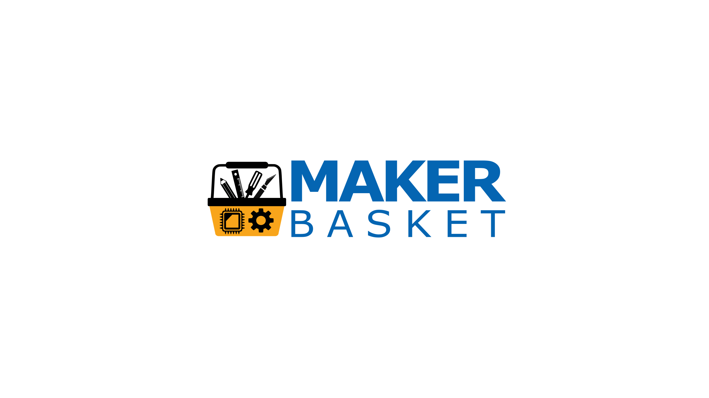
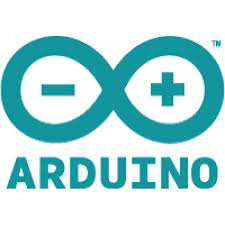
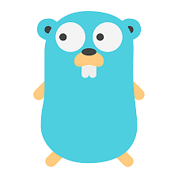
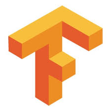
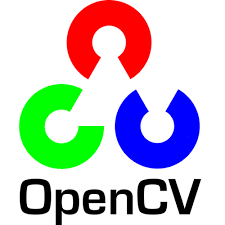

## - 👋 Hi, I’m @geekydoodle</h2>
## - 👀 I’m interested in Python, OpenCV, TensorFlow, Arduino, C, Golang</h2>
## - 🌱 I’m currently learning python, opencv, tensorflow, arduino, C, golang</h2>
## - 💞️ I’m looking to collaborate on new project ideas on the above</h2>
## - 📫 How to reach me : as of now privacy policy does not allow me to be contacted.

#  Programing languages I learning

  

<h1>&nbsp;&nbsp;&nbsp;&nbsp;&nbsp;&nbsp;Python&nbsp;&nbsp;&nbsp;&nbsp;&nbsp;&nbsp;&nbsp;&nbsp;&nbsp;&nbsp;&nbsp;&nbsp;&nbsp;&nbsp;&nbsp;&nbsp;&nbsp;&nbsp;&nbsp;C&nbsp;&nbsp;&nbsp;&nbsp;&nbsp;&nbsp;&nbsp;&nbsp;&nbsp;&nbsp;&nbsp;&nbsp;&nbsp;&nbsp;&nbsp;&nbsp;&nbsp;&nbsp;Arduino</h1>

<h1>&nbsp;&nbsp;&nbsp;&nbsp;&nbsp;&nbsp;Golang

#  Frameworks I am learning

  
